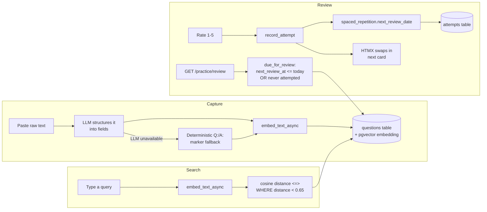
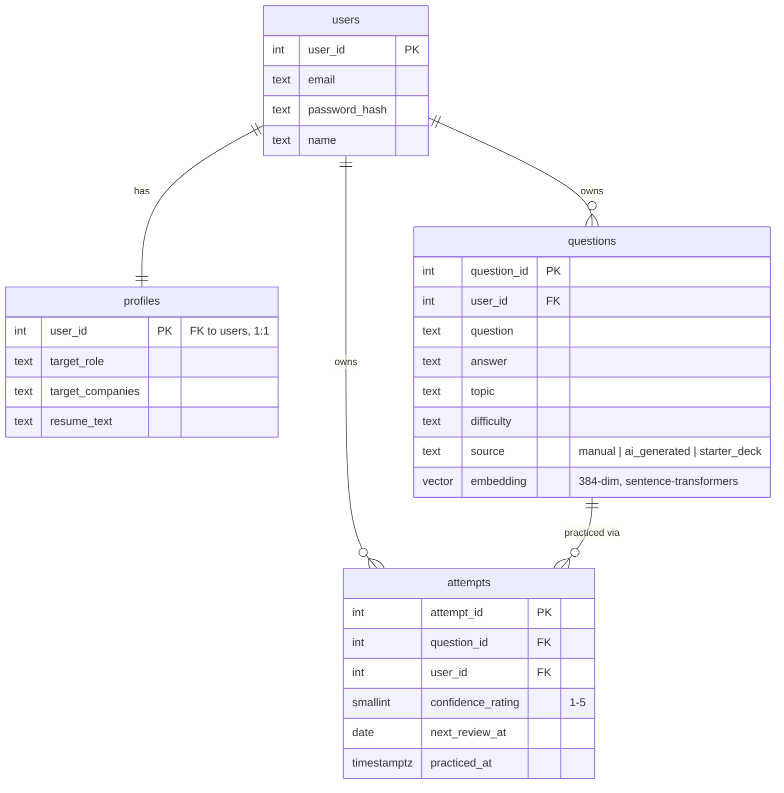

# Architecture

## Request path: capturing and reviewing a question

## Module layout

Each feature is a self-contained package under `app/`: `auth`, `profile`, `practice`,
`dashboard`. Every one follows the same shape:

- `router.py` — FastAPI routes. Thin: parses the request, calls `service.py`, picks a
  template. No SQL, no business logic here.
- `service.py` — the actual logic and SQL. Framework-agnostic; could be called from a CLI
  script (see `scripts/seed.py`) without touching FastAPI at all.
- `extraction.py`, `spaced_repetition.py` (in `practice/`) — pure functions with no I/O,
  which is exactly why they're the only things with unit tests today (see
  [`tests/`](tests/)). `spaced_repetition.next_interval_days` in particular takes a rating
  and a previous interval and returns a new interval — no database, no clock dependency
  beyond an injectable `today` parameter.

`app/core/` holds cross-cutting concerns every feature package depends on but none of them
own: `config.py` (settings), `db.py` (the asyncpg pool), `security.py` (password hashing,
sessions), `llm.py` (the provider-swap LLM client), `embedder.py` (sentence-transformers),
`templates.py` (one shared Jinja environment), `logging.py`.

This is a deliberately flat "modular monolith" shape, not a hard rule about layers — the
point is that `practice/service.py` has no idea FastAPI exists, so it's testable and
reusable on its own.

## Data model

`attempts.user_id` is a deliberate denormalization (it's derivable via `questions.user_id`)
-- every ownership check and every query that scopes by user filters `attempts` directly by
it, rather than joining through `questions` every time. It's also what closes the ownership
bug documented in the code review this file exists in response to: without it, there was no
cheap way to verify a review-rating request actually belongs to the question's owner.

## Why no multi-tenancy

This schema has one row per user, not per (tenant, user) -- see
[`docs/adr/001-lineage-and-scope.md`](docs/adr/001-lineage-and-scope.md) for why that's a
deliberate choice rather than an oversight.

## Production hardening

`app/core/middleware.py` adds three cross-cutting layers, wired up in `app/main.py`:

- **`SecurityHeadersMiddleware`** -- `X-Content-Type-Options`, `X-Frame-Options`,
  `Referrer-Policy` on every response, plus HSTS when `APP_ENV=production`.
- **`RateLimitMiddleware`** -- per-IP fixed window on `/login` (10/min) and `/signup`
  (5/min) to blunt credential stuffing and signup spam. It's in-memory and per-process: a
  multi-worker or multi-replica deployment enforces the limit separately in each process,
  so the effective ceiling scales with worker count. Tests set
  `settings.disable_rate_limits = True` (see `tests/conftest.py`) since httpx's
  `ASGITransport` gives every test the same client IP.
- **`MaxBodySizeMiddleware`** -- rejects an oversized request by its declared
  `Content-Length` before FastAPI buffers the body (2MB default, 11MB on `/profile` for
  the resume upload). It trusts the header, so a client that omits it (chunked transfer)
  isn't caught here -- the resume upload's own byte-counted read cap in
  `app/profile/router.py` is the real backstop for that specific attack surface.

Two auth-adjacent details worth knowing: `auth/service.py::authenticate` always runs a
bcrypt comparison, even against a dummy hash for a nonexistent email, so a timing
difference can't be used to enumerate registered addresses; and `difficulty` is normalized
to `easy|medium|hard` in `practice/service.py` before every insert/update, because that
value can arrive from an LLM or a user's free-text paste (not just the capture form's
`<select>`) and the column has a `CHECK` constraint.

Deployment notes: the Docker image runs as a non-root user and exposes `WEB_CONCURRENCY`
(default 1) to control `uvicorn --workers`; each worker loads its own copy of the
sentence-transformers model, so raising it trades memory for throughput. `/healthz` backs
both the container `HEALTHCHECK` and `docker-compose`'s `depends_on: condition:
service_healthy`.

## Further reading

- [`docs/spaced-repetition.md`](docs/spaced-repetition.md) -- how the review scheduling
  algorithm works and why.
- [`docs/semantic-search.md`](docs/semantic-search.md) -- what an embedding is and why
  pgvector, with a concrete example of a query keyword search would miss.
