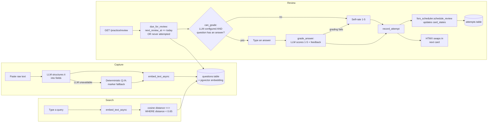
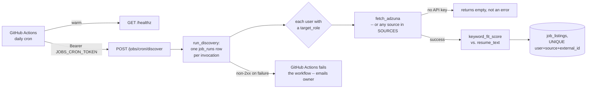
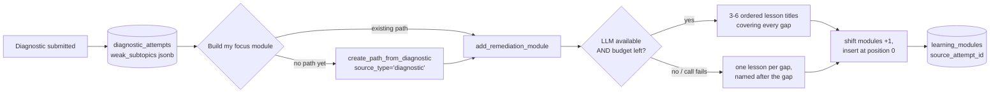
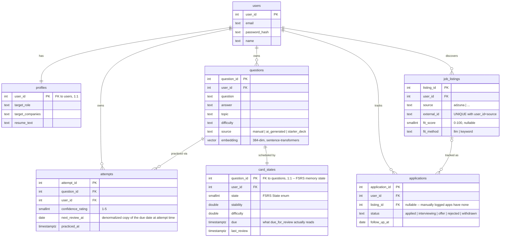

# Architecture

## Request path: capturing and reviewing a question

## Module layout

Each feature is a self-contained package under `app/`: `account`, `analytics`,
`assessments`, `auth`, `classrooms`, `dashboard`, `documents`, `gamification`, `guardian`,
`jobs`, `labs`, `learning_paths`, `mentor`, `notifications`, `practice`, `profile`,
`projects`. Every one follows the same shape:

- `router.py` — FastAPI routes. Thin: parses the request, calls `service.py`, picks a
  template. No SQL, no business logic here.
- `service.py` — the actual logic and SQL. Framework-agnostic; could be called from a CLI
  script (see `scripts/seed.py`) without touching FastAPI at all.
- Supporting modules alongside them hold the logic that isn't request- or SQL-shaped:
  `practice/extraction.py` (marker parsing) and `practice/grading.py`,
  `practice/fsrs_scheduler.py` (the FSRS wrapper — see
  [`docs/spaced-repetition.md`](docs/spaced-repetition.md)), `jobs/scoring.py`,
  `jobs/gap_analysis.py`, `labs/math_service.py`. The pure ones take an injectable `today`/
  `now` rather than reading the clock, which is what makes them directly unit-testable (see
  [`tests/`](tests/)).

`app/core/` holds cross-cutting concerns every feature package depends on but none of them
own: `config.py` (settings), `db.py` (the asyncpg pool), `security.py` (password hashing,
sessions), `llm.py` (the provider-swap LLM client), `embedder.py` (sentence-transformers),
`templates.py` (one shared Jinja environment), `logging.py`.

This is a deliberately flat "modular monolith" shape, not a hard rule about layers — the
point is that `practice/service.py` has no idea FastAPI exists, so it's testable and
reusable on its own.

## Honest grading

A self-rating is unreliable input to a spaced-repetition scheduler -- people rate
themselves 5 on things they can't actually explain, and the scheduler faithfully believes
them. `practice/router.py::_can_grade` decides per card whether review shows a typed-answer
form (graded by `practice/grading.py::grade_answer`, an LLM call scoring 1-5 against the
stored answer with feedback on what was missed) or falls back to the original self-rate
form -- and it's `True` by default whenever an LLM is configured and the question has a
stored answer to grade against, not an opt-in. Three fallback paths, in order: no LLM key
configured (`core/llm.py::is_configured`), the question has no stored answer, or the
grading call itself fails at runtime -- a transient LLM hiccup falls back to self-rating for
that one card rather than losing the typed answer to a 500. Either path ends at the same
`record_attempt` and the same scheduler; grading only changes what produces the 1-5 rating,
never how that rating is used afterward.

## Scheduled job discovery

Render's free tier has no cron and no background workers, and free web services sleep
after 15 minutes idle — an in-process scheduler would be asleep whenever it was due. So the
schedule lives outside the app entirely: `.github/workflows/jobs-discover.yml` runs once
daily, warms the instance (`GET /healthz`, since a cold start takes ~50s), then
`POST /jobs/cron/discover` with a bearer token checked via `secrets.compare_digest` against
`JOBS_CRON_TOKEN`. An unset token fails closed (503) rather than accepting an empty
submitted one — "unconfigured" is never a backdoor "disabled".

`app/jobs/sources.py`'s `RawListing` dataclass and `fetch_*(keywords, max_results)` signature
are the seam for adding a second source (Greenhouse/Lever public board APIs) without
touching `service.py`: append the function to `SOURCES` and it's tried independently per
user, so one source failing doesn't stop the others. Fit scoring is deliberately
keyword-only for now (`app/jobs/scoring.py`, scored against the *listing's* vocabulary so a
long resume can't inflate its own score) — no LLM key required, matching the rest of the
app's "degrade to something deterministic" pattern rather than a hard dependency.

## Diagnostic to learning path

A diagnostic used to dead-end: it named the subtopics you missed and then linked you to
"start a learning path", leaving you to retype the gaps by hand. `POST
/assessments/result/{attempt_id}/reinforce` closes that loop —
`learning_paths/service.py::add_remediation_module` turns the stored `weak_subtopics` into a
focus module and inserts it at **position 0**, shifting every existing module down one.

Top, not bottom, is the whole point: re-planning around a measurement means the measured gap
is what you study next, and appending it last would bury it under modules the diagnostic just
showed you don't need yet.

Three details worth naming. The budget is consumed with `consume_llm_budget` in a `try`,
falling back rather than 429ing (the pattern `get_lesson` already uses) — a student out of
budget still gets their measured gaps turned into a real, checkable plan, just without
AI-written titles; a 429 would strand the one page whose entire purpose is "here's what to do
next". Lesson *content* is not generated here at all: each new lesson gets its content on
first open through `get_lesson`'s existing cache-and-generate path, so this route makes at
most one LLM call regardless of how many lessons it creates. And `learning_modules
.source_attempt_id` carries a partial unique index on `(path_id, source_attempt_id)`
(migration 0021), which makes a double-click or a back-and-resubmit return the existing
module instead of stacking duplicates.

## Skill gap analysis

`app/jobs/gap_analysis.py` is the feature the rest of the app's data exists to feed: paste a
job description, one LLM call extracts the skills it requires, and each is diffed against
two things this app already has -- `profiles.resume_text` (does the resume claim it?) and
`attempts` (has the user actually *recalled* it, average confidence >= 3, not just attempted
it once badly?). The middle bucket -- on the resume but never practiced, or practiced with
weak recall -- is the one no other tool can produce, because no other tool holds both the
resume and real attempt history. A malformed or missing LLM response surfaces as a plain
502 with the actual error shown (`app/jobs/router.py::run_gap_analysis`), the same
fail-loud-not-silently pattern as `/practice/study-card`; there's no deterministic fallback
here since reliably extracting skills from free text without an LLM isn't a solved problem
the way marker-parsing a structured Q:/A: paste is.

## Data model

The core loop's tables, below. The later phases add their own — `learning_paths` →
`learning_modules` → `learning_units` → `learning_lessons`, `diagnostic_attempts`,
`xp_events`, `mentor_conversations`/`mentor_messages`, `projects`/`project_milestones`/
`project_submissions`, `classrooms`/`classroom_members`/`assignments`, `guardian_links`,
`notifications`, `documents`, `llm_usage` — each introduced by its own numbered file in
[`migrations/`](migrations/), which is the authoritative schema.

`attempts.user_id` is a deliberate denormalization (it's derivable via `questions.user_id`)
-- every ownership check and every query that scopes by user filters `attempts` directly by
it, rather than joining through `questions` every time. It's also what closes the ownership
bug documented in the code review this file exists in response to: without it, there was no
cheap way to verify a review-rating request actually belongs to the question's owner.

## Why no multi-tenancy

This schema has one row per user, not per (tenant, user) -- see
[`docs/adr/001-lineage-and-scope.md`](docs/adr/001-lineage-and-scope.md) for why that's a
deliberate choice rather than an oversight.

## Production hardening

`app/core/middleware.py` adds three cross-cutting layers, wired up in `app/main.py`:

- **`SecurityHeadersMiddleware`** -- `X-Content-Type-Options`, `X-Frame-Options`,
  `Referrer-Policy` on every response, plus HSTS when `APP_ENV=production`.
- **`RateLimitMiddleware`** -- per-IP fixed window on `/login` (10/min) and `/signup`
  (5/min) to blunt credential stuffing and signup spam. It's in-memory and per-process: a
  multi-worker or multi-replica deployment enforces the limit separately in each process,
  so the effective ceiling scales with worker count. Tests set
  `settings.disable_rate_limits = True` (see `tests/conftest.py`) since httpx's
  `ASGITransport` gives every test the same client IP.
- **`MaxBodySizeMiddleware`** -- rejects an oversized request by its declared
  `Content-Length` before FastAPI buffers the body (2MB default, 11MB on `/profile` for
  the resume upload). It trusts the header, so a client that omits it (chunked transfer)
  isn't caught here -- the resume upload's own byte-counted read cap in
  `app/profile/router.py` is the real backstop for that specific attack surface.

`app/core/llm_budget.py`'s `require_llm_budget` is a separate, DB-backed layer in front of
every AI-calling route (`/practice/structure`, `/practice/study-card`): unlike
`RateLimitMiddleware`, it's per-user (via the session, not the client IP) and persisted in
the `llm_usage` table, so the limit survives a redeploy or a free-tier spin-down instead of
resetting with an in-memory counter. `LLM_DAILY_BUDGET` (default 20) controls it. It counts
the call before checking the limit, so the request that would push the total over budget is
itself the one rejected with a 429 -- not a bonus call let through first.

Two auth-adjacent details worth knowing: `auth/service.py::authenticate` always runs a
bcrypt comparison, even against a dummy hash for a nonexistent email, so a timing
difference can't be used to enumerate registered addresses; and `difficulty` is normalized
to `easy|medium|hard` in `practice/service.py` before every insert/update, because that
value can arrive from an LLM or a user's free-text paste (not just the capture form's
`<select>`) and the column has a `CHECK` constraint.

Deployment notes: the Docker image runs as a non-root user and exposes `WEB_CONCURRENCY`
(default 1) to control `uvicorn --workers`; each worker loads its own copy of the
sentence-transformers model, so raising it trades memory for throughput. `/healthz` backs
both the container `HEALTHCHECK` and `docker-compose`'s `depends_on: condition:
service_healthy`.

## Further reading

- [`docs/spaced-repetition.md`](docs/spaced-repetition.md) -- how the review scheduling
  algorithm works and why.
- [`docs/semantic-search.md`](docs/semantic-search.md) -- what an embedding is and why
  pgvector, with a concrete example of a query keyword search would miss.
